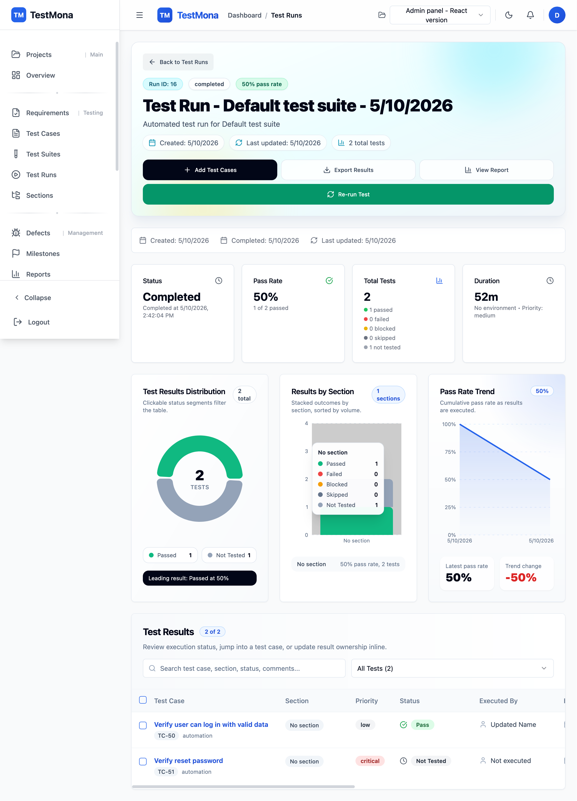
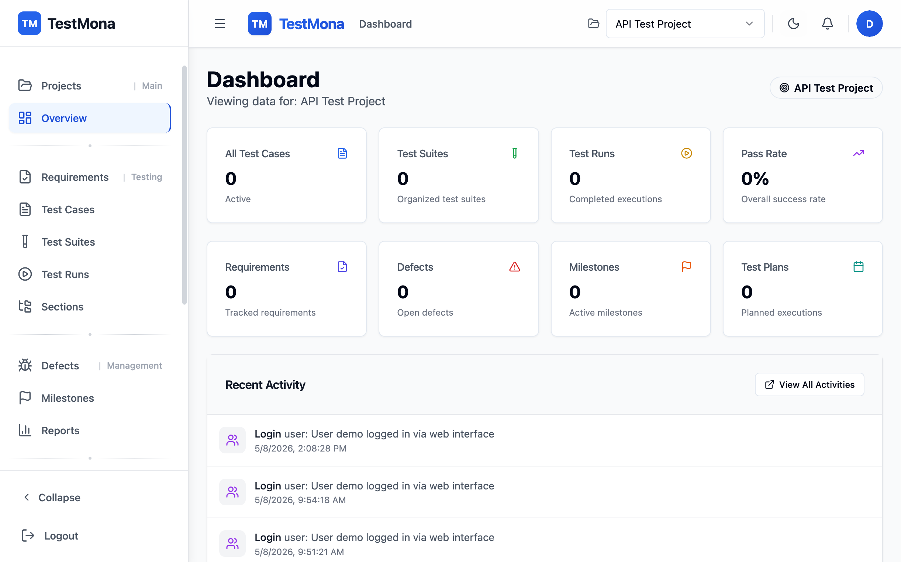

# TestMona

TestMona is a full-stack test management system for organizing QA work across projects. It combines project-scoped requirements, sections, test cases, suites, runs, defects, reports, milestones, reusable test assets, and activity tracking in a React web app backed by a FastAPI API.

**Sponsor or hire us:** Support TestMona or hire us.

- USDT (TRC20) - TRX (Tron): `THVWGyyD7HmFZB8vLakuHxB6VUKXF6Dz8j`
- Polygon: `0xe662c535565e3bbf553ab79a6ca3eb220d65d491`
- SUI: `0xd16f6c89b4f0db396ee3a108d78a90d4469c4acfd36ac9cf76a87d064741f8eb`
- DOT (Polkadot): `135XJi1pK9gK7wdzbj8UUZ5RMzVGXoXkeypV67Hh4g21Dve2`
- Solana: `CLg467FS4PnuV6jBT7fYBHSL8BH4fCcqtGd1WHEufrhN`
- ETH: `0xe662c535565e3bbf553ab79a6ca3eb220d65d491`
- BTC (Bitcoin): `bc1qcc0jyfe8r07uy8r972v9m7pp5cgp9zpd0kkzjs`
- XRP (Ripple): `rKyycDku9qevKWzSw9DxCDUSRXMNFHHq1k`
- TON: `UQDSdI27I1LVRSaflE9GypnWPAGN4z0YARlYJtbF9RmSxzpF`




## What This Project Includes

- Project workspaces with a project selector and project-scoped navigation.
- Requirements, sections, test suites, test cases, test plans, test runs, milestones, and defects.
- Test execution flows with run details, case execution screens, and run reports.
- Test case revision/version history and comparison support.
- Reusable shared steps, custom fields, global parameters, and execution environments.
- Dashboard, reporting, analytics, activity management, notifications, and audit trails.
- User authentication, signup controls, profile management, password changes, and two-factor dialog UI.
- Import/export APIs and Postman collections for backend testing.
- External issue-tracker integration models and clients for Jira, GitLab, and Azure DevOps workflows.
- English, Persian, and Arabic locale files with RTL support in the frontend.

## Tech Stack

| Area | Technology |
| --- | --- |
| Frontend | React 19, TypeScript, Vite, React Router, Zustand, Tailwind CSS, Radix UI, Recharts, TipTap |
| Backend | FastAPI, SQLAlchemy, Alembic, Pydantic, JWT auth, SQLite by default |
| Tooling | Docker Compose, ESLint, Postman collections, pytest dependencies |

## Repository Layout

```text
.
├── backend/                 # FastAPI app, routes, models, migrations, OpenAPI and Postman assets
├── frontend/                # React/Vite application
├── Docs/                    # Project documentation assets, including the dashboard screenshot
├── docker-compose.yml       # Local Docker deployment for frontend and backend
├── install.sh               # Automated local setup and demo user seeding
├── setup.py                 # Alternative setup helper
└── README.md
```

## Requirements

- Python 3.13 or newer for the provided install script and backend Docker image.
- Node.js 18 or newer.
- npm.
- Docker and Docker Compose if using the containerized setup.

The app uses SQLite by default through `DATABASE_URL=sqlite:///./test_management.db`. PostgreSQL-related initialization is present, but the checked-in Docker Compose file currently runs the backend with SQLite.

## Quick Start

### Option 1: Automated Setup

```bash
./install.sh
```

The installer creates a backend virtual environment, installs Python dependencies, creates `backend/.env` if needed, initializes the database, seeds the demo user, installs frontend dependencies, and builds the frontend.

Start the backend:

```bash
cd backend
source venv/bin/activate
uvicorn app.main:app --host 0.0.0.0 --port 8000
```

Start the frontend in another shell:

```bash
cd frontend
npm run dev
```

Open the app at [http://localhost:3000](http://localhost:3000).

### Option 2: Manual Setup

Backend:

```bash
cd backend
python3.13 -m venv venv
source venv/bin/activate
pip install -r requirements.txt
cp .env.example .env
alembic upgrade head
uvicorn app.main:app --reload --host 0.0.0.0 --port 8000
```

Frontend:

```bash
cd frontend
npm install
npm run dev
```

### Option 3: Docker Compose

```bash
docker-compose up --build
```

Docker Compose exposes:

- Frontend: [http://localhost:3000](http://localhost:3000)
- Backend API: [http://localhost:8000](http://localhost:8000)
- Swagger/OpenAPI docs: [http://localhost:8000/docs](http://localhost:8000/docs)

## Demo Login

The automated installer seeds this demo administrator account:

```text
Email: demo@testmona.com
Password: demo123
```

Change the password after first login before using the app beyond local development.

## Backend API

The FastAPI app is configured in `backend/app/main.py` and registers route modules for:

- Authentication, refresh tokens, logout, and current-user lookup.
- User and system settings management.
- Projects and project assignments.
- Test management entities such as suites, cases, runs, steps, sections, environments, schedules, and execution engines.
- Requirements, defects, milestones, test plans, traceability, and coverage.
- Analytics dashboards, KPIs, granular insights, shareable reports, root-cause analysis, and dashboard widgets.
- Notifications, audit trails, custom fields, shared steps, import/export, and versioning.

API documentation is generated at `/docs` when the backend is running.

## Frontend App

The Vite frontend is configured in `frontend/vite.config.ts` to run on port 3000 and proxy `/api` requests to the backend. Authenticated routes are wrapped by the main layout and project-specific pages use `ProjectGuard` to ensure a project context exists.

Key screens include:

- Projects and dashboard overview.
- Requirements, sections, test cases, suites, plans, runs, reports, milestones, and defects.
- Test case details, editing, revision history, and execution.
- Shared steps, custom fields, global parameters, and environments.
- Activity management, settings, and profile pages.

## Useful Commands

Frontend:

```bash
cd frontend
npm run dev
npm run build
npm run lint
npm run preview
```

Backend:

```bash
cd backend
source venv/bin/activate
uvicorn app.main:app --reload --host 0.0.0.0 --port 8000
alembic upgrade head
pytest
```

## Configuration

Backend configuration is loaded from environment variables and `backend/.env` through `backend/app/config.py`.

Common backend settings:

| Variable | Default | Purpose |
| --- | --- | --- |
| `DATABASE_URL` | `sqlite:///./test_management.db` | Database connection string |
| `SECRET_KEY` | generated if missing | JWT signing key; set explicitly for production |
| `ALGORITHM` | `HS256` | JWT algorithm |
| `ACCESS_TOKEN_EXPIRE_MINUTES` | `480` | Access token lifetime |
| `REFRESH_TOKEN_EXPIRE_DAYS` | `7` | Refresh token lifetime |
| `ALLOWED_ORIGINS` | `http://localhost:3000` | CORS origin list |

Frontend API target:

```bash
VITE_API_URL=http://localhost:8000
```

## API Testing Assets

Backend API testing resources are checked in under `backend/postman_collections/`, with collections grouped by feature area and supporting environment/global files. A combined collection is also available at `backend/postman_collection.json`.

## Documentation Assets

The dashboard screenshot used in this README is stored at `Docs/Screenshot.png`. The folder currently only contains visual documentation assets, so no restructure was necessary.
